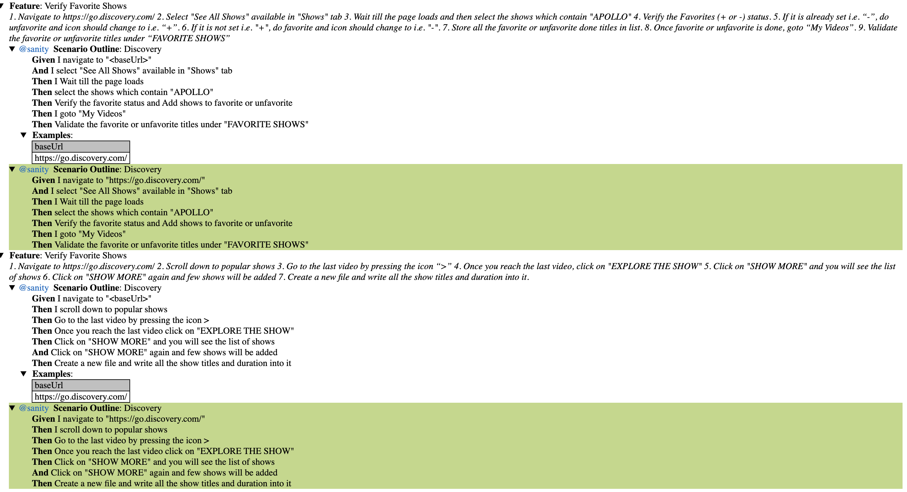

# Prerequisites:
1. Java 1.8 installed
2. Maven installed : https://maven.apache.org/install.html
3. Preferred IntelliJ IDE
4. Note: Test run on Mac OS, shall work seamlessly on Windows

# Steps to Run UI Tests:
1. From terminal 
   $cd discovery-ui
2. Run command
	 $ mvn install -Dmaven.test.skip=true
3. Run command
   $ mvn test
   
# Test Results: 
1. Results episodes.csv file for Test2: 
   $ cd discovery-ui/src/test/java/output
2. Test Summary Report for UI Tests: 
   target/cucumber-reports/index.html
   

 
